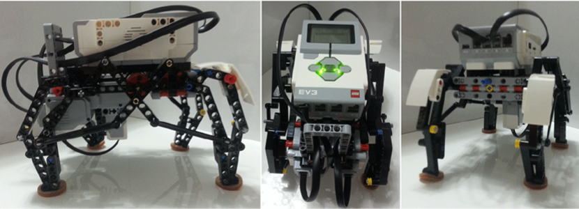

# Quadrupedal Robot Design and Control

## Introduction

In this robotics assignment, I have explored the walking locomotion type by assembling and controlling a simple quadrupedal robot. The goal was to build a functional quadrupedal robot capable of moving forward, backward, leftward, and rightward while adjusting its speed. To achieve this, I followed the building instructions provided in the Lego Mindstorm EV3 starter kit. The robot construction involved three main parts: Module Construction, Legs Construction, and Body Construction. The functional quadrupedal design is shown below:

## Robot Control

To control the quadrupedal robot, I programmed it using MATLAB environment with the help of the official Introduction_to_EV3_with_MATLAB_Simulink.pdf file, which proved to be a valuable resource. The robot control involved writing two MATLAB functions:

1. **remotedControlledMotion.m**: This function enables remote control of the robot using the Infrared sensor with the Beacon. It allows the robot to move forward, backward, leftward, and rightward, with the flexibility to adjust its speed. 

2. **calibration.m**: Ensuring a smooth walking motion is essential for the robot's stability. For this purpose, I referred to the calibration algorithm discussed in the lab and implemented it as a MATLAB function called calibration.m. This function adjusts the leg positions of the robot using the Touch sensor, optimizing its initial posture for stable locomotion. To streamline the process, I assigned one of the commands of the Beacon as "calibration" and called the calibration function from ControlledMotion.m after it was thoroughly tested.

## Report and Results

For a more detailed report of this work, you can find the PDF [here](Moses%20Chuka%20Ebere%20-%20ME%20525%20-%20Lab%20Exercise%201.pdf). The report address specific questions related to the robot's performance and motion analysis:

1. **Robot Stability**: The report discusses how the robot ensures its stability, either statically or dynamically. Additionally, it includes distinct event sequences depicting the robot's walking patterns based on its footprints.

2. **Remote Control Motion**: An analysis of the robot's ability to move straight and turn accurately when controlled remotely. To support the analysis, encoder values of both motors are plotted, offering a clear visualization of the robot's movements.

3. **Speed Impact on Motion**: The report explores the impact of the robot's speed on its motion accuracy. Encoder values of both motors during straight motion are plotted for different speeds, providing valuable insights into the robot's performance at varying speeds.

## Resources

For repeatability purposes, the `.mat` files generated during the experiments are included in the `Matlab .mat files` subdirectory. 

## Conclusion

Completing this robotics assignment has been an enriching experience. Through systematic problem-solving, we successfully designed and controlled a quadrupedal robot capable of diverse movements (using the Lego Mindstorm EV3 toolkit). The calibration process played a vital role in achieving stable locomotion, ensuring a robust foundation for further exploration and experimentation.

The knowledge and skills gained from this project have reinforced my passion for robotics and automation. I look forward to applying these learnings to future projects and challenges in the exciting field of robotics.

*Note: The quadrupedal robot design and control assignment was completed as part of a robotics course. All credit goes to the instructors and the institution for providing the opportunity to undertake this project.*
