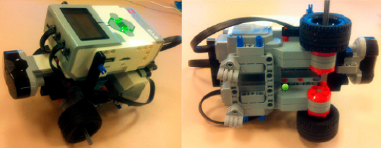

# Two-Wheeled Robot Construction and Odometry Estimation

## Introduction

Welcome to the Two-Wheeled Robot Construction and Odometry Estimation experiment. In this assignment, we have successfully constructed a two-wheeled robot as shown in Figure 1(a). The robot consists of two actuated (front) wheels and two passive (rear) castor wheels to provide support and stability. To model the robot's motion, we utilized the two-wheeled differential drive robot model, which requires position (x, y) and orientation (θ) information (Figure 1(b)).

## Differential Drive Robot Model

The motion of the robot can be modeled discretely using the encoder values of the left and right motors. The following equations represent the robot's next step position and orientation (x(k+1), y(k+1), θ(k+1)) based on its current position and orientation (x(k), y(k), θ(k)):

x(k + 1) = x(k) + De * cos(θ(k) + Δθ)
y(k + 1) = y(k) + De * sin(θ(k) + Δθ)
θ(k + 1) = θ(k) + Δθ

where De is the distance traveled by the center of the wheels, and Δθ is the change in the angle for a specified time period. The values De and Δθ can be calculated based on the distances traveled by the right (Dr) and left (Di) wheels.

In this lab, we implemented the differential-drive robot model and collected position and orientation data during the robot's motion. Initially, we assumed x(0) = 0, y(0) = 0, and θ(0) = 0.

## Programming the Robot

To program the robot, we connected it to the PC via a USB cable and used the MATLAB environment. We found the Introduction_to_EV3_with_MATLAB_Simulink.pdf file to be highly useful for guidance throughout the programming process.

## Post-Lab Report

The [report](Moses%20Chuka%20Ebere%20-%20ME%20525%20-%20Lab%202.pdf) discusses various aspects of the robot's motion and odometry estimation:

1. **Linear Motion**: We applied the same amount of power to both motors several times for forward and backward motion. We analyzed the calculated odometry, the desired trajectory, and the error. We generated the desired trajectory and plotted both the desired trajectory and calculated odometry on the same figure.

2. **Circular Motion**: We stopped the left motor and applied power only to the right motor for circular motion. We examined the calculated odometry, the desired trajectory, and the error. We generated the desired trajectory and plotted both the desired trajectory and calculated odometry on the same figure.

3. **Effect of Time Periods**: We investigated how odometry estimations and errors change when decreasing and increasing time periods for encoder differences (ΔE) during circular motion.

4. **Effect of Motor Power**: We studied the impact of decreasing and increasing power to the right motor during circular motion on odometry estimations and errors.

## Resources

For repeatability purposes, the `.mat` files generated during the experiments are included in the `Matlab .mat files` subdirectory. 

## Conclusion

Completing the Two-Wheeled Robot Construction and Odometry Estimation experiment has been a valuable learning experience. We successfully constructed a two-wheeled robot and estimated its odometry using the differential drive model. Through this project, we honed our programming skills using MATLAB and gained insights into the complexities of robot motion and trajectory estimation.

The ability to implement and analyze the robot's motion and odometry estimation enhances our understanding of robotics principles. We look forward to applying this knowledge to future projects and contributing to the exciting field of robotics.

*Note: This assignment was completed as part of a robotics course. All credit goes to the instructors and the institution for providing the opportunity to undertake this project.*
