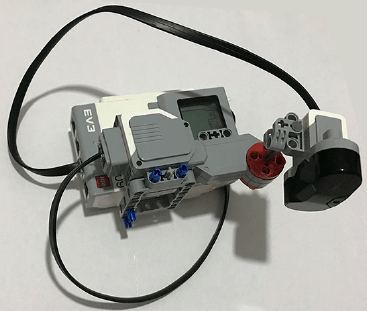

# Building a Range Finder Sensor

## Introduction

In this robotics assignment, I successfully built a range finder using an infrared sensor and a large motor, as shown in the figure below using parts for the lego mindstorms ev3 toolkit. The range finder allows the robot to measure distances to objects in its environment and calculate corresponding x-y coordinates based on the angle of the infrared sensor.

## Range Finder Operation

To operate the range finder, I employed a large motor to rotate the infrared distance sensor between 0 and 180 degrees. At each cycle, the infrared sensor was utilized in proximity distance mode to obtain measurements. Using the measured distance (d) and the angle between the x-axis of the robot and the direction of the infrared sensor (θ), obtained from the encoder of the large motor, I calculated the corresponding x-y coordinates using the following equations:

x = d * cos(θ)

y = d * sin(θ)

It was important to note that the `readRotation` function used to read encoder values returned the angle in degrees and in `int32` format. Therefore, I converted the value to `double` and utilized `cosd` and `sind` functions for accurate calculations.

## Implementation

I wrote a single file called `rangeFinder.m` to scan the environment between 0 - 180 degrees and detect distances until the up button on the brick was pushed. Before writing the main program, I took several measurements from the infrared sensor in proximity distance mode and found a coefficient to convert the measurements to centimeters.

## Experimentation

Initially, the main program was implemented as a loop controlled by the up button, rotating the motor between 0 and 180 degrees multiple times. To avoid confusion, I displayed the required variables at each instance. Once the proper motion between 0 and 180 degrees was ensured, I took measurements from the infrared sensor and calculated the corresponding x-y coordinates using equation (1), assuming the sensor was located at the (0,0) position.

At each scan, I stored and plotted all x-y coordinates as blue stars and annotated the current measurement as a red line, as shown in Figure 1. To clear the figure in each step, I used the `clf` command, and I added a pause (`delT`) command to allow MATLAB to plot the new data.

## Post-Lab Report

The [report](Moses%20Chuka%20Ebere%20-%20ME%20525%20-%20Lab%203.pdf) addressed the following questions:

1. **Environment Scan**: When I scanned the environment without any obstacles, the result showed an unobstructed plot. Commenting on the result, I observed that the plot resembled a smooth curve without any abrupt changes.

2. **Impact of Obstacles**: Upon adding an obstacle, the resultant plot changed significantly. The points around the obstacle appeared scattered, forming a distinct pattern. The shape and color of the obstacle influenced the measurements by causing fluctuations in distance readings.

3. **Motor Speed**: I experimented with different motor speeds to observe their impact on measurements. Higher motor speeds led to shorter scanning durations, resulting in fewer data points collected within the same angular range. Slower motor speeds, on the other hand, allowed for more precise measurements due to increased data acquisition.

## Conclusion

Building the range finder sensor has been an enlightening experience, allowing me to gain hands-on experience with hardware assembly and sensor interfacing. The ability to measure distances and calculate x-y coordinates opens up exciting possibilities for autonomous robotics and obstacle avoidance applications.

Through this assignment, I have enhanced my proficiency in MATLAB programming and data visualization, which are valuable skills in the robotics domain. I look forward to further exploring the applications of range finder sensors and continuing my journey in the fascinating world of robotics.

*Note: This assignment was completed as part of a robotics course. All credit goes to the instructors and the institution for providing the opportunity to undertake this project.*
