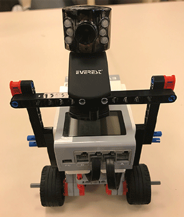

# Estimation of Time to Collision

## Introduction

In this robotics assignment, I successfully built a differential drive robot equipped with a camera to estimate the time to collision (TTC) with an obstacle using parts for the lego mindstorms ev3 toolkit and a webcam. The objective was to simplify the object detection process using a paperboard obstacle with a simple pattern (figure below). By leveraging the MATLAB Support Package for Webcam Cameras and Computer Vision Toolbox, I acquired and processed sequential images to extract the height of the obstacle in pixels.

## Implementing the TTC Calculation Algorithm

To measure the height of the black rectangle (obstacle) in the images, I utilized the `detectHarrisFeatures` function to extract corners in the obtained image. I then selected the strongest 20 features and found the maximum and minimum values to plot a rectangle around the object and calculate the length of the right/left edge.

The TTC was calculated using the formula:

TTC = L / (dL / dt)

where `L` is the height of the obstacle in sequential images, and `dL / dt` is the change in height over the time interval `dt` between the acquisition of these images. If the robot is stationary, the TTC is set to zero to avoid infinite values.

## Testing the Robot

I conducted several test cases to evaluate the performance of the TTC estimation:

1. **Test 1: Fixed Obstacle Moving Robot**: Placed the obstacle at a distance and allowed the robot to move towards it. Checked the time to collision and stopped the robot after an appropriate time in a safe distance.

2. **Test 2: Fixed Obstacle Moving Robot Repeatedly**: Repeated Test 1 by moving the robot back for a few seconds and then letting it go towards the obstacle again.

3. **Test 3: Fixed Robot Moving Obstacle**: Placed the robot at a distance to the obstacle and moved the obstacle towards the robot. Checked the time to collision and moved the robot back when the obstacle exceeded the safe distance.

4. **Test 4: Moving Robot and Obstacle**: Placed the obstacle at a distance and let both the robot and the obstacle move towards each other. Checked the time to collision and moved the robot back when the obstacle exceeded the safe distance.

## Implementing the Algorithm

I divided the implementation into three MATLAB files:

- `main.m`: This is the main program that handles the Lego connection, motor connections, and camera setup. It controls the robot's motion and TTC estimation.

- `getImgFindCorners.m`: This file acquires images from the camera, detects the obstacle by extracting corner features, and highlights the rectangle around it.

- `calculateTTCandMove.m`: This file calculates the TTC as per the algorithm and moves the robot according to the defined test cases.

## Post-Lab Report

In the post-lab [report](Moses%20Chuka%20Ebere%20-%20ME%20525%20-%20Lab%204.pdf), I completed all the test cases and commented on the results. I explained how I decided the time to stop the robot and how changing the robot's speed influenced the stopping time (applicable to Test 1). Additionally, I described the criteria for choosing `dt` (time interval) between image acquisitions.

## Conclusion

The Estimation of Time to Collision assignment was a valuable opportunity to develop my skills in robotics, computer vision, and algorithm implementation. By successfully building and testing the differential drive robot equipped with a camera, I gained hands-on experience in real-world applications of TTC estimation.

The ability to estimate TTC is crucial for safe robot navigation and obstacle avoidance in dynamic environments. The project deepened my understanding of image processing techniques and their application in robotics. I look forward to exploring more advanced techniques in computer vision and pursuing further challenges in the fascinating field of robotics.

*Note: This assignment was completed as part of a robotics course. All credit goes to the instructors and the institution for providing the opportunity to undertake this project.*
