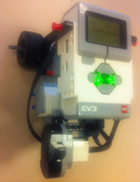
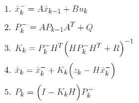

# Kalman Filter Implementation for Differential Drive Robot

## Introduction

In this robotics assignment, I successfully implemented a simple Kalman filter on a differential drive two-wheeled robot equipped with an infrared sensor mounted at a 90-degree angle (Figure 1). The goal was to estimate the changes along the y-axis using a 1D Kalman filter while applying input powers forward and backward along the x-axis.

## Implementing the Kalman Filter

To implement the Kalman filter, I considered the following key points:

- Variance of Process Noise (Q): I calculated the variance of process noise by taking several distance measurements with the infrared sensor during the same motion. By analyzing these measurements, I determined the disturbances that result in deviations along the y-axis and used them to calculate the variance of process noise Q.

- Variance of Measurement Noise (R): Since the measurements were assumed to be almost accurate, the variance of measurement noise (R) was set to a small value, e.g., R = 0.0001.

I applied the Kalman filter in a loop controlled by the 'up' button to continuously estimate the deviations along the y-axis. The system was modeled as a 1D system with the following equations:

- Process Model: `x_k = x_(k-1) + w_(k-1)`
- Measurement Model: `z_k = k = x_(k-1) + v_k`

Kalman Filter Equations:

## Post-Lab Report

In the post-lab [report](Moses%20Chuka%20Ebere%20-%20ME%20525%20-%20Lab%205.pdf), I addressed the following questions:

1. **Finding Variance of Process Noise**: I explained my variance calculation procedure and plotted the measurements taken during this process. By analyzing the data, I determined the appropriate variance of process noise (Q).

2. **Storing and Plotting Values**: I stored and plotted the values of predicted state, Kalman gain, (Co)variance matrix, and measurements. I observed how the Kalman gain (K) and the variance (P) changed during the process. I plotted the estimated state and the measured values on the same figure and discussed the result. I observed how the robot's estimations followed its measurements and analyzed whether the variance `P(k)` converged to zero over time.

## Conclusion

Implementing the Kalman filter on the differential drive robot was an enlightening experience in robotics and estimation techniques. By successfully estimating the changes along the y-axis using the 1D Kalman filter, I gained valuable insights into filtering and sensor fusion. The ability to accurately estimate the robot's state despite noisy measurements is crucial for enhancing navigation and control in real-world robotic applications.

The assignment deepened my understanding of Kalman filter equations and their application in robotics, making me more confident in my ability to handle complex estimation problems. The implementation and analysis of the Kalman filter results have opened doors for me to explore advanced control and state estimation techniques in future robotics projects.

*Note: This assignment was completed as part of a robotics course. All credit goes to the instructors and the institution for providing the opportunity to undertake this project.*