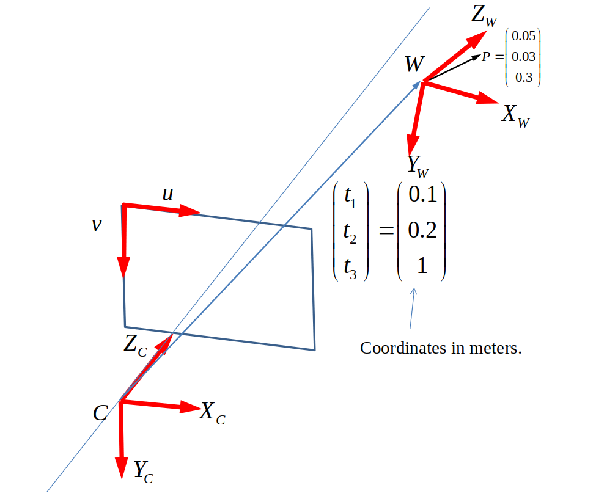

# Camera Projection - Image Frame Calculation

## Introduction

In this robotics assignment, I successfully implemented a MATLAB program to calculate the pixel coordinates of a given 3D point in the image frame. The task (summarized in the figure below) involved understanding camera projection, focal length, and image frame parameters to accurately determine the pixel location of a point in the image. 

## Camera Parameters

- Image plane dimensions: 24 mm x 24 mm
- Image frame dimensions: 1000 pixels x 1000 pixels
- Image frame center: Located on the ZC axis of the camera frame
- Focal length: 30 mm

## Problem Statement

Given the following information:
- Rotation matrix R (describing the orientation of the world frame with respect to the camera axis)
- Coordinates of the world frame in the camera frame: (t1, t2, t3)
- Coordinates of a point P described in the world frame: (0.05, 0.03, 0.3)

## Implementation

I developed 2 MATLAB programs to compute the pixel coordinates of point P in the image frame. The first one implements the camera projection equations from scratch while the second one uses some inbuilt functions from the Computer Vision Toolbox. Succinctly put, the implementation involved the following steps:

1. Calculate the projection matrix using the focal length and image frame dimensions.
2. Transform the point P from the world frame to the camera frame using the given rotation matrix R and translation vector (t1, t2, t3).
3. Project the transformed point onto the image plane to find its pixel coordinates.

## Results

After running the MATLAB program, the pixel coordinates of point P in the image frame were successfully determined. The calculated pixel coordinates represent the position of point P in the image, which can be used for further image processing or robot vision applications.

## Report 

A detailed [report](Moses%20Chuka%20Ebere%20-%20ME%20525%20-%20Assignment%205.pdf) of the implementation is also included. 

## Conclusion

Completing this camera projection assignment has deepened my understanding of camera calibration and image projection techniques. By developing the MATLAB program, I was able to accurately compute the pixel coordinates of a 3D point in the image frame. 

*Note: This assignment was completed as part of a robotics course. All credit goes to the instructors and the institution for providing the opportunity to undertake this project.*
