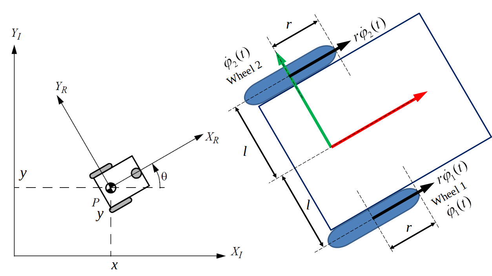
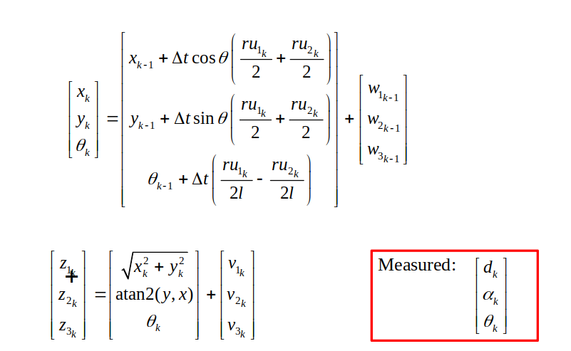

# Extended Kalman Filter Estimation for Robotic System

## Introduction

In this robotics assignment, I successfully implemented a MATLAB program that implements an Extended Kalman Filter Estimation Simulation for a differential drive robot (figure below).

The state and measurement equations are given below:

## Extended Kalman Filter (EKF) Algorithm

The EKF algorithm extends the conventional Kalman Filter to handle nonlinear systems. It approximates the system dynamics using a first-order Taylor series expansion around the current state estimate. The main steps of the EKF algorithm are as follows:

1. Initialization: Initialize the state vector and covariance matrix.
2. Prediction Step: Predict the next state and covariance using the system dynamics and control inputs.
3. Measurement Update Step: Update the state estimate using measurements from sensors, taking into account the measurement noise.
4. Repeat: Continue the prediction and update steps for each time step.

## Result

After running the MATLAB simulation program, I obtained the estimated state vector for the robotic system. The plots show how the estimation evolves over time and compare it with the true system state (see the report). The results demonstrate the effectiveness of the EKF algorithm in accurately estimating the system's state despite noise and uncertainties.

## Report 

A detailed [report](Moses%20Chuka%20Ebere%20-%20ME%20525%20-%20Assignment%206.pdf) of the implementation is also included. 

## Conclusion

Implementing the Extended Kalman Filter for state estimation in this robotic system was a challenging yet rewarding experience. The MATLAB simulation successfully estimated the entire state vector, and the plots provided valuable insights into the system's behavior. This project has enhanced my understanding of state estimation techniques, and I am now better equipped to tackle real-world robotics challenges.

*Note: This assignment was completed as part of a robotics course. All credit goes to the instructors and the institution for providing the opportunity to undertake this project.*
