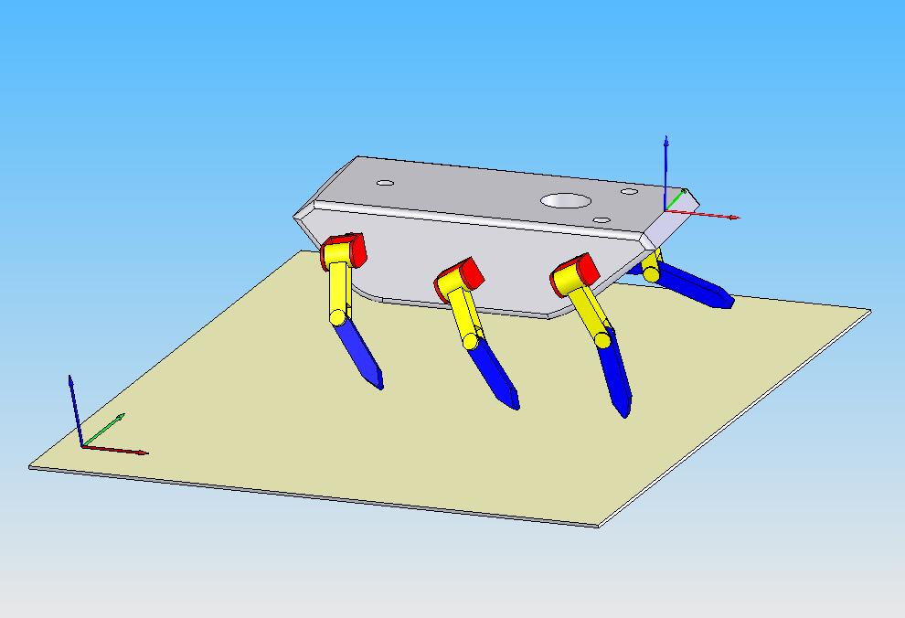
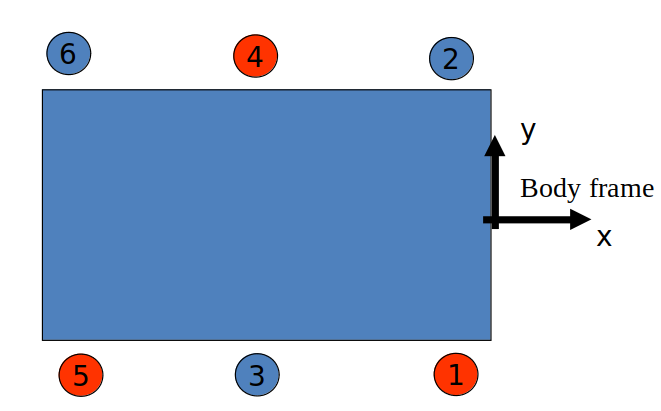

# Legged Robot Trajectory Generation

## Introduction

In this robotics assignment, I successfully implemented a trajectory generation approach for a legged robot with 6 legs. The goal was to generate smooth trajectories for the foot tip references of foot number 1 and foot number 2, expressed in the body-attached coordinate frame.

|  |  |
|:---------------------------------------:|:---------------------------------------:|
|                Isometric View                  |                Planar View                  |

## Trajectory Generation Approach

To achieve smooth trajectories, I utilized the "1-cos type curves" approach. The trajectory generation involved the following steps:

1. **Swing of Legs 4 and 5**: I implemented simultaneous swinging for legs 4 and 5, ensuring a coordinated motion.

2. **Swing of Legs 3 and 6**: Similarly, I applied simultaneous swinging for legs 3 and 6, maintaining synchronization in their motion.

3. **Foot Tip References**: I calculated the x, y, and z directional foot tip references for foot number 1 and foot number 2, expressed in the body-attached coordinate frame.

4. **Shoulder Coordinates**: The shoulder coordinates were assigned at the same height as the body coordinate frame. The x coordinate of the shoulders was set 40 cm away from the body coordinate frame in the y-direction.

5. **Body Height**: The body was positioned 50 cm above the ground level during the walk.

6. **Walking Period**: The walking period was set to 3 seconds to achieve the desired gait.

## Added Task

Following the above implementation, the MATLAB program was also designed to compute and plot origin coordinate of the robot's body-frame in the world frame for a 15-second walk.

## Report 

A detailed [report](Moses%20Chuka%20Ebere%20-%20ME%20525%20-%20Assignment%204.pdf) of the implementation is also included. 

## Conclusion

The trajectory generation approach using "1-cos type curves" successfully generated smooth and synchronized trajectories for the foot tip references of the legged robot. By implementing this approach, I gained valuable insights into legged robot motion planning and trajectory generation techniques. The ability to create coordinated foot trajectories is essential for stable and efficient locomotion of legged robots in various real-world scenarios.

Note: This assignment was completed as part of a robotics course. All credit goes to the instructors and the institution for providing the opportunity to undertake this project.
