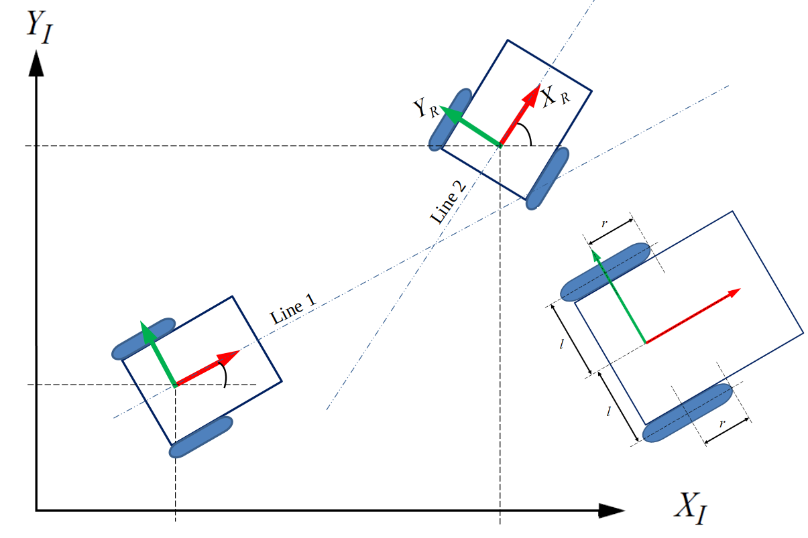

# Wheel Robot Trajectory Determination

## Introduction

In this computational assignment, I successfully tackled the challenge of determining the trajectory of a wheel robot. The problem required implementing a MATLAB program to compute and plot the Cartesian trajectory, wheel angles, and wheel speeds as the robot follows a specific path.

## Problem Definition

The trajectory involves the following steps:

1. **Starting Position**: The robot initiates its movement from point A and follows the first line until it reaches the intersection point of the first and second lines. At this intersection, it turns to align with the second line and continues following the second line until it reaches the target point B.

Given the following information:
- Point A coordinates: (x0, y0)
- Intersection point coordinates: (x_int, y_int)
- Target point B coordinates: (x_target, y_target)
- Distance between wheel centers: L (m)
- Radius of the wheels: r (m)
- Time increment: 1 ms

## Implementation and Results

### Cartesian Trajectory (x-y plane)

I implemented the trajectory in MATLAB and successfully computed and plotted the Cartesian trajectory on the x-y plane using a time increment of 1 ms. The trajectory plot demonstrates the robot's path from point A to the intersection point and then to the target point B.

### Wheel Angles

Using the trajectory data, I computed the angles of the wheels throughout the robot's travel. The wheel angles were plotted against time using a time increment of 1 ms.

### Wheel Speeds

Next, I calculated the wheel speeds throughout the robot's journey and visualized the results by plotting the wheel speeds against time with a time increment of 1 ms.

### Cartesian Trajectory from Wheel Speeds

To cross-check the results, I derived the Cartesian trajectory from the calculated wheel speeds. The plot of this trajectory was compared with the previously obtained Cartesian trajectory to ensure consistency and accuracy.

## Parameter Mismatch Simulation

In the second part of the assignment, I repeated the calculations with a parameter mismatch. Specifically, I assigned a different value (0.095 m) for the right wheel, simulating a mismatch between the model and the real-world robot.

## Report 

A detailed [report](Moses%20Chuka%20Ebere%20-%20ME%20525%20-%20Assignment%203.pdf) of the implementation is also included. 

## Conclusion

Completing this computational assignment allowed me to gain valuable insights into trajectory determination and wheel robot motion planning. By implementing the MATLAB program, I successfully computed and plotted the Cartesian trajectory, wheel angles, and wheel speeds, ensuring smooth and precise movement from the starting point to the target location.

*Note: This assignment was completed as part of a robotics course. All credit goes to the instructors and the institution for providing the opportunity to undertake this project.*
