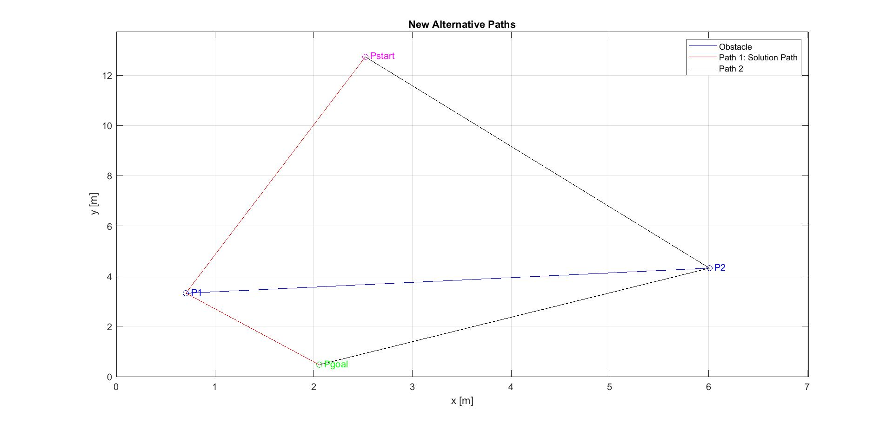

# Visibility Graph Path Planning

## Introduction

In this robotics assignment, I successfully implemented a MATLAB program for path planning using the visibility graph approach. The goal is to find the shortest path for a mobile robot represented by a point, from the start point (Pstart) to the goal point (Pgoal) while avoiding obstacles represented by line segments on the x-y plane.

## Problem Description

The visibility graph problem deals with determining the optimal path for the mobile robot while avoiding obstacles in its path. The robot is assumed to be a holonomic point robot, which simplifies the planning process.

## Implementation

I implemented the visibility graph approach in MATLAB to find the best path for the mobile robot. The program first checks whether a straight line between the start and goal positions intersects any of the obstacle line segments. If there is no intersection, the straight line from the start point to the goal point becomes the final solution path.

In case of an intersection, the program calculates two alternative paths, each consisting of two line segments, and chooses the one with the shortest overall length as the solution path. The figure above illustrates both cases.

## Results

After running the MATLAB program, I obtained the optimal solution path for the mobile robot. The program successfully identified whether an obstacle intersected the straight line between the start and goal points and selected the appropriate path accordingly. The solution path was plotted on the x-y plane, showing the robot's trajectory to reach the goal while avoiding obstacles.

## Report 

A detailed [report](Moses%20Chuka%20Ebere%20-%20ME%20525%20-%20Assignment%207.pdf) of the implementation is also included. 

## Conclusion

Implementing the visibility graph path planning algorithm was a challenging and rewarding experience. The MATLAB program successfully determined the best path for the mobile robot, taking into account obstacle avoidance. This assignment has enhanced my understanding of path planning algorithms and their applications in robotics.

*Note: This assignment was completed as part of a robotics course. All credit goes to the instructors and the institution for providing the opportunity to undertake this project.*
